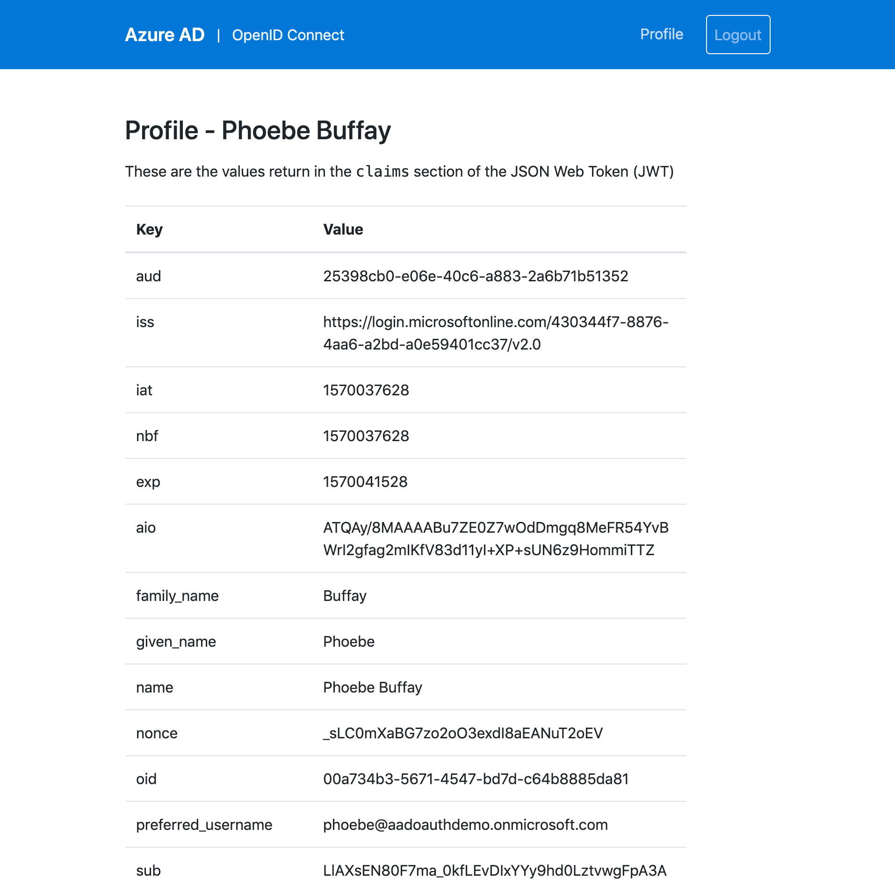
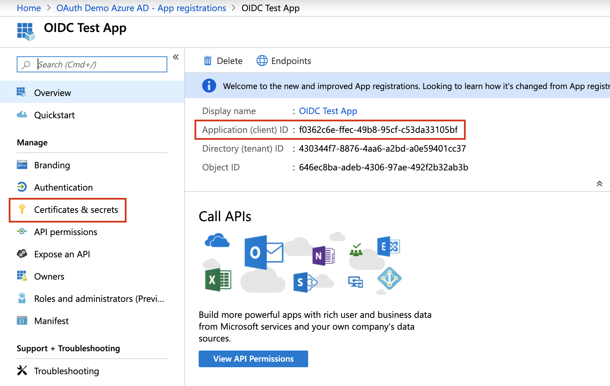

# OpenID Connect and Azure AD - Demo App

This demo Node.js app shows how to use passport.js to implement OpenID Connect against Azure Active Directory (AD)

[](https://oidc-demo.azurewebsites.net/)


Try it out at **[https://oidc-demo.azurewebsites.net](https://oidc-demo.azurewebsites.net/)** with any of the following test accounts:


| Name | Username | Password | 
|:--|:--|:--|
| Alice Samson | alice@aadoauthdemo.onmicrosoft.com | WalterGropius5 |
| Phoebe Buffay | phoebe@aadoauthdemo.onmicrosoft.com | WalterGropiusStrasse5 |
| Rachel Gabor | rachel@aadoauthdemo.onmicrosoft.com | WalterGropiusStrasse5 |
| Ross Smith | ross@aadoauthdemo.onmicrosoft.com | WalterGropiusStrasse5 |
| Joey Taylor | joey@aadoauthdemo.onmicrosoft.com | WalterGropiusStrasse5 |


## Local Demo

First clone this repository

```
https://github.com/julie-ng/azure-openid-connect-demo
```

### Configure

If you want to try the demo locally you need to [register an application](https://docs.microsoft.com/en-us/azure/active-directory/develop/howto-create-service-principal-portal) with your Azure AD tenant. Once you've done that, note the client ID and secret.



For local development, create an `.env` file based on template `.env.sample` and fill it out with your application values, esp. the Azure AD Tenant IDs and the Client ID.

```
PORT=3000
TENANT_ID=
CLIENT_ID=
CLIENT_SECRET=
APP_ID=
…
```

### Generate Secrets for Session

If you open [app/config/oidc.js](./app/config/oidc.js) you will notice the app requires encryption keys for the cookie. To help you out, you can use this helper to generate keys

```
npm run generate-keys
```

Once you've configured everything, start up the nodejs application and redis server for sessions store.

```
docker-compose up --build
```
